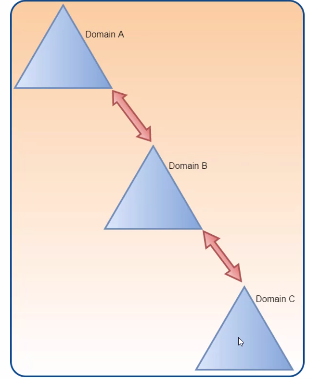
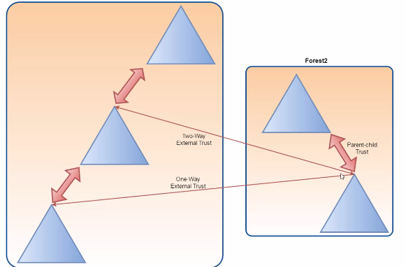

# Trusts
- Trusts is a relationship between two domains or two forests which allows users of one domain or forest to access resources in the other domain or forest.
- Trust can be automatic (parent-child,same forest etc) or established (forest,external).
- Trusted domain objects (TDOs) represent the trust realtionships ina domain.
### Trust Directions
#### 1-One-way
Only the trusted domain can access resources of the trusting domain

#### 2-Two-way
Both domains can access each other resources

### Trust transitivity
- A trust can be extended to establish trust relationships with other domains.
-- All the default intra-forest trust relationships (Tree-root,Parent-Child) between domains within a same forest are transitive two-way trusts.

### Domain Trusts
- **Default/Automatic Trusts**
-- Parent-Child -> it's created automatically between the new domain and the domain that preceds it in the namespace hierarchy,whenever a new domain is added in a tree.
-- This trust is always two-way transitive.

- **External trusts**
-- Between two domains in different forests when forests do not have a trust relationship.
-- Can be one-way or two-way relations and is **non-transitive**.

### Forest Trusts
- Between forest root domain.
- Cannot be extended to a third forest (no implicit trust).
- Can be one-way or two-way and transitive and non-transitive.

