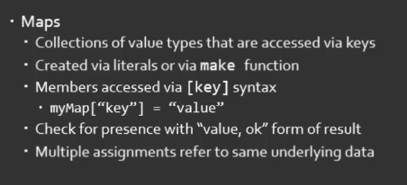

# Maps & Structs
## Basic syntax
```go
package main

import (
	"fmt"
)

func main() {
	StatePopulations := map[string]int{
		"Quds": 4518616,
		"Aleppo": 1812649,
		"Afghanistan": 2848284,
		"Borma": 481949,
		"Pakistan": 8418455,
		"Yemen": 841488,
	}
	fmt.Println(StatePopulations)
}
```

## If you want to create an empty map to add items later
```go
package main

import (
	"fmt"
)

func main() {
	StatePopulations := make(map[string]int)
	StatePopulations = map[string]int{
		"Quds": 4518616,
		"Aleppo": 1812649,
		"Afghanistan": 2848284,
		"Borma": 481949,
		"Pakistan": 8418455,
		"Yemen": 841488,
	}
	fmt.Println(StatePopulations)
}

```
## Manipulating items
Every added item will be placed upon alphanumerical order
```go
package main

import (
	"fmt"
)

func main() {
	StatePopulations := make(map[string]int)
	StatePopulations = map[string]int{
		"Quds": 4518616,
		"Aleppo": 1812649,
		"Afghanistan": 2848284,
		"Borma": 481949,
		"Pakistan": 8418455,
		"Israel": 90009,
		"Yemen": 841488,
	}
	StatePopulations["Quds"] = 31337
	StatePopulations["India"] = 44444
	delete(StatePopulations, "Israel")
	fmt.Println(StatePopulations["Quds"])
	fmt.Println(StatePopulations)
}
```
## OK operator to check for the presence of an item
```go
package main

import (
	"fmt"
)

func main() {
	StatePopulations := make(map[string]int)
	StatePopulations = map[string]int{
		"Quds": 4518616,
		"Aleppo": 1812649,
		"Afghanistan": 2848284,
		"Borma": 481949,
		"Pakistan": 8418455,
		"Yemen": 841488,
	}

	_, ok := StatePopulations["meow"]
	fmt.Println(ok)
}
```
## Manipulating the map in one place is going to impact all other places it's referenced to
```go
package main

import (
	"fmt"
)

func main() {
	StatePopulations := make(map[string]int)
	StatePopulations = map[string]int{
		"Quds": 4518616,
		"Aleppo": 1812649,
		"Afghanistan": 2848284,
		"Borma": 481949,
		"Pakistan": 8418455,
		"Israel": 90009,
		"Yemen": 841488,
	}
	sp := StatePopulations
	delete(StatePopulations, "Israel")
	fmt.Println(sp)
	fmt.Println(StatePopulations)
}
```

## Structs
## Basic Syntax
```go
package main

import (
	"fmt"
)

type car struct{
	year int
	Driver string
	company []string
}

func main() {
	fetch := car{
		year: 2021,
		Driver: "Zeyad",
		company: []string{
			"honda",
			"bently",
			"ferrari",
		},
	}
	fmt.Println(fetch.year)

}
```
## Anonymous Struct
```go
package main

import (
	"fmt"
)


func main() {
	car := struct{name string}{name: "Benlty"}

	fmt.Println(car.name)

}
```
## Manipulating the values doesn't alter the struct values
```go
package main

import (
	"fmt"
)


func main() {
	car := struct{name string}{name: "Benlty"}
	car2 := car
	car2.name = "Meow"
	fmt.Println(car.name)
	fmt.Println(car2.name)
	fmt.Println(car.name)

}
```

## Composing a Struct characteristics into another (Not a typical inheritence)
```go
package main

import (
	"fmt"
)

type Animal struct{
	Name string
	Origin string
}

type Bird struct{
	Animal
	SpeedKPH float32
	canfly bool
}

func main() {
	b := Bird{}
	b.Name = "bebo"
	b.Origin = "7ara lol"
	b.SpeedKPH = 1.2
	b.canfly = false
	fmt.Println(b.Name)

}
```

## Summary



